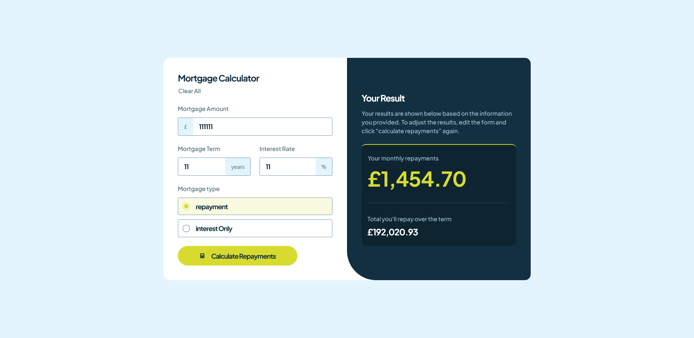
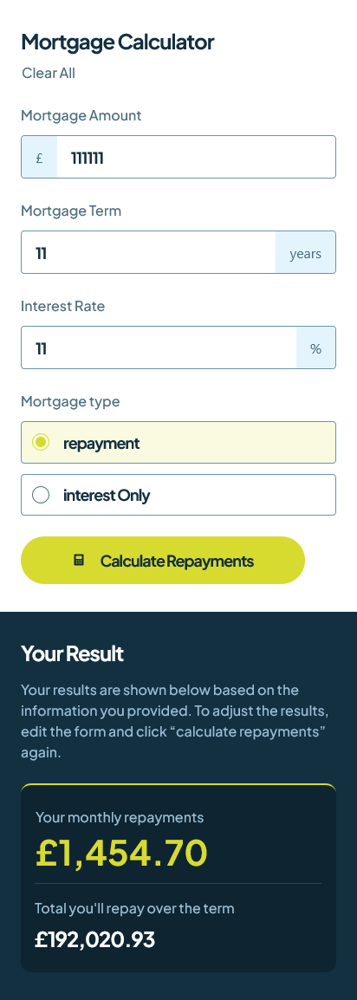

# Mortgage Repayment Calculator - Thomas Sifferle 🏠


[](https://github.com/TomSif)
[](https://reactjs.org/)
[](https://vitejs.dev/)
[](https://tailwindcss.com/)
[](https://www.typescriptlang.org/)



### 🌐 Live Demo:

**[View live site →](https://front-end-mentor-mortgage-repayemen.vercel.app/)**

Deployed on Vercel with HTTPS and performance optimizations.

---

This is a solution to the [Mortgage Repayment Calculator challenge on Frontend Mentor](https://www.frontendmentor.io/challenges/mortgage-repayment-calculator-Galx1LXK73). Frontend Mentor challenges help you improve your coding skills by building realistic projects.

## Table of contents

- [Overview](#overview)
  - [The challenge](#the-challenge)
  - [Screenshot](#screenshot)
  - [Links](#links)
- [My process](#my-process)
  - [Built with](#built-with)
  - [What I learned](#what-i-learned)
  - [Continued development](#continued-development)
- [Author](#author)
- [Acknowledgments](#acknowledgments)

## Overview

### The challenge

Users should be able to:

- Enter a mortgage amount, term, interest rate, and mortgage type (Repayment or Interest Only)
- See form validation messages when any field is empty on submit
- See a dynamic results panel update with monthly repayment and total amount when the form is submitted
- Reset all inputs and results with a single "Clear All" action
- View the optimal layout depending on their device's screen size
- See hover and focus states for all interactive elements on the page

### Screenshot



### Links

- Solution URL: [GitHub Repository](https://github.com/TomSif/Front-end_Mentor_Mortgage_Repayement_Calculator)
- Live Site URL: [Vercel Deployment](https://front-end-mentor-mortgage-repayemen.vercel.app/)

## My process

### Built with

- Semantic HTML5 markup (`fieldset`, `legend` for form grouping)
- CSS custom properties
- Mobile-first workflow
- [React 19](https://react.dev/) - JS library
- [TypeScript](https://www.typescriptlang.org/)
- [Vite](https://vitejs.dev/) - Build tool
- [Tailwind CSS v4](https://tailwindcss.com/) - Utility-first CSS (`@tailwindcss/vite` plugin, `@theme` variables, `@utility` presets)
- [clsx](https://github.com/lukeed/clsx) + [tailwind-merge](https://github.com/dcastil/tailwind-merge) — `cn()` utility for conditional classNames

### What I learned

#### Custom hook — `useMortgageCalculator`

Extracting the calculation logic into a dedicated `useMortgageCalculator` hook was the architectural centrepiece of this project. The hook owns a `useState<Result | null>` internally, exposes a `calculate(inputs: Inputs)` function and a `reset()` function, and returns the current result. This kept `App` free of business logic.

```ts
// The hook's public surface:
const { result, calculate, reset } = useMortgageCalculator();
```

Two mortgage formulas live inside the hook — standard Repayment (compound amortisation) and Interest Only. The `totalRepayment` for Interest Only required a specific correction: it isn't `monthlyPayment * n` but `monthlyPayment * n + loanAmount`, a bug I identified and fixed independently during a code review pass.

#### Lifting state and the `onChange: (field, value)` pattern

`FormSection` started as a stateful component, then was refactored into a controlled ("dumb") component with all state lifted to `App`. The key prop signature became:

```ts
onChange: (field: keyof Inputs, value: string) => void
```

This pattern — passing both the field name and the value up — lets a single handler in `App` update one key at a time:

```ts
const handleChange = (field: keyof Inputs, value: string) => {
  setInputs((prev) => ({ ...prev, [field]: value }));
};
```

The combination of `keyof Inputs` (constraining the key) and computed property names (`[field]: value`) required deliberate practice before becoming reliable.

#### TypeScript — `Record<K, V>` and mapped types

The `Errors` type is derived directly from `Inputs` using a mapped type, so adding a field to the form automatically extends the error tracking:

```ts
type Errors = Record<keyof Inputs, boolean>;
```

This `data-first` approach — deriving types from the actual data shapes rather than declaring them upfront — continued the methodology started in the previous project and produced leaner, more accurate types.

#### Validation — `Object.values().some()` pattern

Form validation on submit checks each field in `Inputs` and marks it as an error if empty. Rather than a chain of `if` statements, the result is collected into an error object and a single check determines whether to abort:

```ts
const handleSubmit = () => {
  const newErrors: Errors = {
    mortgageAmount: inputs.mortgageAmount === "",
    mortgageTerm: inputs.mortgageTerm === "",
    interestRate: inputs.interestRate === "",
    loanType: inputs.loanType === "",
  };
  setErrors(newErrors);
  if (Object.values(newErrors).some(Boolean)) return;
  calculate(inputs);
};
```

`Object.values().some(Boolean)` was new — once understood as "does any value in this object satisfy a condition", it became an immediate reflex for multi-field early returns.

#### Input filtering without `useEffect`

The numeric text inputs needed to reject non-numeric characters and prevent multiple decimal points. The initial instinct was to use `useEffect` to watch the value and clean it — which is incorrect. Input filtering is a synchronous transformation that belongs directly in the `onChange` handler, not a side-effect after render:

```ts
const filtered = value.replace(/[^0-9.]/g, "");
const sanitised = filtered.split(".").slice(0, 2).join(".");
```

`maxLength` on the input element handled length capping cleanly, avoiding an over-engineered regex solution.

#### Accessibility — `useId()`, `aria-describedby`, `aria-live`

Each `InputNumber` instance generates its own unique id via `useId()`, used to wire up `aria-describedby` between the input and its error message. This ensures screen readers announce the relevant error without relying on DOM proximity:

```tsx
const id = useId();
// ...
<label htmlFor={id} className="sr-only">{label}</label>
<input id={id} aria-describedby={`${id}-error`} aria-invalid={isError} ... />
{isError && <p id={`${id}-error`}>{errorMessage}</p>}
```

`role="alert"` was deliberately avoided on error messages — it conflicts with `aria-describedby` and causes double announcements. `aria-live="polite"` was placed on the `ResultSection` container so the computed results are announced after the calculation completes without interrupting ongoing screen reader output.

#### Tailwind v4 focus states — `peer-*`, `group-*`, `has-*`, `in-*`

This project was the first to use Tailwind v4's relational variants systematically. Several important distinctions were worked through:

- **`peer-focus-visible:`** — styles a sibling based on the focus state of the peer element. Used to show a visible ring on the radio circle when the hidden native input is focused via keyboard.
- **`group-focus-within:`** — styles a descendant based on any focused element inside the group ancestor. Used to highlight the `InputNumber` wrapper when any child is focused.
- **`focus-within:` vs `in-focus-within:`** — critical directional distinction: `focus-within:` checks whether a _descendant_ of the element is focused; `in-focus-within:` checks whether an _ancestor_ is in a focus-within state. Using the wrong one silently produces no visual change.
- **`has-focus-visible:`** — native Tailwind v4 syntax (no brackets needed for common pseudo-classes), applied to a label to highlight it when a descendant receives keyboard focus.

```html
<!-- Radio focus ring via peer -->
<input type="radio" class="sr-only peer" />
<div class="peer-focus-visible:border-lime ..."></div>

<!-- InputNumber wrapper highlight -->
<div class="group focus-within:border-lime ...">
  <input class="group-focus-within:bg-lime/15 ..." />
</div>
```

#### Clear All — coordinated state reset

The "Clear All" button resets three independent state slices: `inputs`, `errors`, and the calculator result. The result lives inside the hook, so the hook exposes a `reset` function that sets its internal state back to `null`:

```ts
// In App:
const handleClearAll = () => {
  setInputs(defaultInputs);
  setErrors(defaultErrors);
  reset(); // from useMortgageCalculator
};
```

A subtle ordering issue surfaced during implementation: `reset` must be destructured from the hook before `handleClearAll` is declared, otherwise the variable is used before it exists. JavaScript hoisting does not apply to `const` declarations from hook destructuring.

#### Algorithmic decomposition — the O7 protocol

The session that introduced `useMortgageCalculator` produced the first complete "blank wall" in twelve projects: faced with implementing the hook, it became impossible to write a single line without first knowing exactly what goes in, what happens to it, and what comes out. The fix — writing the three steps in plain French before touching the keyboard — became a mandatory protocol for every new function from that point forward:

> **O7:** Before writing any new function: write in French (1) what goes in, (2) what is done with it, (3) what comes out. No code before all three are clear.

### Continued development

- **`keyof` and mapped types** — `Record<keyof Inputs, boolean>` is now understood, but the general pattern of deriving types from other types needs more projects before it becomes the default reflex.
- **Relational Tailwind v4 variants** — `peer-*`, `group-*`, `has-*`, and `in-*` directions are conceptually clear but not yet fully automatic. The `in-*` vs `focus-within:` distinction still requires deliberate verification.
- **O7 decomposition under pressure** — the pseudo-code-first protocol works well when applied, but the instinct to skip it under complexity still surfaces. Making it a non-negotiable reflex is the active goal.
- **TypeScript prop typing** — the distinction between typing the whole object (`result: Result | null`) versus a key inside the object (`result: { result: Result | null }`) still requires conscious effort. One more project with complex prop shapes should anchor it.

## Author

- Frontend Mentor - [@TomSif](https://www.frontendmentor.io/profile/TomSif)
- GitHub - [@TomSif](https://github.com/TomSif)

## Acknowledgments

This project was built with AI-assisted mentoring (Claude). The approach: I code by hand, Claude acts as a Socratic mentor — asking questions, explaining concepts, reviewing my reasoning. Architectural decisions (how to structure state, when to extract a hook, what to lift) stayed mine.

Specific AI contributions are documented transparently in my [progression log](./progression.md):

- **Written by Claude:** project scaffold (`chore/setup` commits), design tokens in `index.css`, TypeScript syntax when blocked
- **My initiative:** autonomous identification of the `totalRepayment` Interest Only bug, the decision to lift state from `FormSection` to `App`, implementing `Clear All` from scratch without hints, identifying the missing `checked` prop on the radio input from keyboard symptoms
- **Collaborative:** building `useMortgageCalculator` after guided decomposition, working through `Object.values().some()` validation pattern, debugging Tailwind v4 focus variants, establishing the O7 pseudo-code protocol
